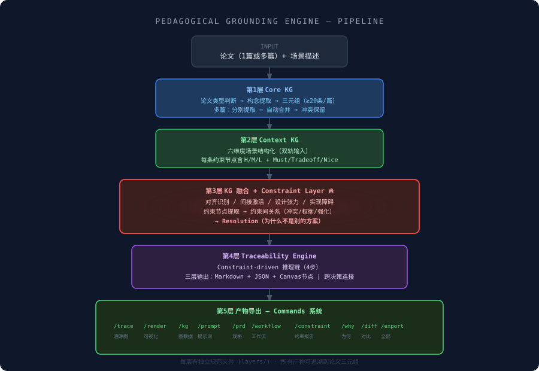
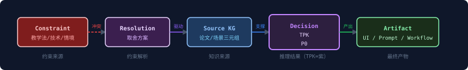

# Pedagogical Grounding Engine

> **把每一个设计决策变成一个有学术溯源的推理结果。**

这个 skill 不是"把论文翻译成产品"，而是构建一套推理系统——让教学法机制成为产品设计的约束，让每一个 feature 的存在都有明确的理论依据，让"为什么不是别的设计"这个问题有清晰的答案。

---

## 流水线总览



---

## Traceability Map 节点类型

流水线产出的 Canvas 图包含五类节点，从左到右排列：



---

## 文件结构

```
skill-paper-to-prd/
├── SKILL.md                    # 主入口：五层流水线概览 + Commands
│
├── layers/                     # 每层的详细处理规范
│   ├── layer1-core-kg.md       # 论文类型判断、三元组提取、多篇合并
│   ├── layer2-context-kg.md    # 六维度场景结构化、双轨输入处理
│   ├── layer3-kg-fusion.md     # 四种融合操作 + Constraint Layer 完整流程
│   ├── layer4-traceability.md  # 决策生成规则、三层输出、Canvas JSON schema
│   └── layer5-export.md        # 所有命令的生成规范和错误处理
│
├── references/                 # 参考资料
│   ├── kg-vocabulary.md        # KG 谓词词汇表 + EdTech 常见三元组集群
│   ├── tpack-guide.md          # TPACK 七区域 + 教学策略词汇表
│   ├── spec-templates.md       # PRD/TASKS/DESIGN 完整模板
│   └── canvas-renderer-hint.md # Canvas 渲染工具选型（React Flow / Cytoscape / Obsidian）
│
└── examples/                   # 真实输出示例
    ├── cscl-example.md         # CSCL论文完整五层执行记录
    ├── output-trace.json       # /trace 命令输出：Canvas JSON（18节点/17边）
    ├── output-prompt.md        # /prompt 命令输出：完整 System Prompt
    └── output-prd.md           # /prd 命令输出：PRD + TASKS + DESIGN
```

---

## 快速开始

### 1. 单篇论文

```
用户：[粘贴论文内容]

场景：线上大学研讨课，6-8人小组，需要解决沉默学生参与问题，
     教师同时管理多个房间。无数据库，原型阶段。
```

Skill 自动执行五层流水线，完成后输出 Commands 菜单。

### 2. 多篇论文（推荐指定模式）

```
用户：以下是两篇论文，请用模式3合并（默认）：
     论文A：[内容]
     论文B：[内容]

场景：[场景描述]
```

### 3. 直接调用命令（流水线已完成后）

```
/trace          → 获取 Traceability Map
/render         → 获取可交互的 Canvas 图（React Flow 组件）
/why 私信nudge  → 解释为什么是90秒而不是60秒
/prd            → 获取三份工程规格文件
```

---

## 核心概念

### Constraint Layer（约束层）

这是整个系统的设计辩护力所在。它回答的不是"这个 feature 从哪来"，而是"为什么不是别的 feature"。

每对约束关系都有一个 **Resolution**，Resolution 必须包含：
- 具体的取舍决定（不是"做更好的平衡"，而是"用点状仪表盘而非数字表格"）
- 明确牺牲了什么（"牺牲精确数值"）
- 被排除的替代方案（"被排除：实时数字显示——原因：认知负荷过高"）

### Traceability 节点（推理节点）

每个设计决策都是一个 Traceability 节点，包含三层：

| 层 | 格式 | 用途 |
|---|---|---|
| 层A：Markdown 可读层 | 结构化文本 | 人工审阅、内容创作 |
| 层B：JSON 机器层 | 结构化 JSON | 代码生成、工具集成 |
| 层C：Canvas 图节点数据 | JSON nodes + edges | 可视化渲染 |

### Commands 系统

流水线不是一次性的。完成后，用户可以随时用命令召唤特定输出，无需重跑。

最有力的命令是 `/why [功能名]`——它会输出完整的反事实分析："如果把这个约束改掉，设计会变成什么样。"

---

## 设计原则（Harness Engineering）

本 skill 的处理规范遵循以下原则：

**输入契约**：每层明确声明前置条件（preconditions）。如果前一层的输出不满足要求，本层不执行，而是报告具体缺失。

**输出契约**：每层有明确的 postconditions，下一层可以依赖这些保证，无需重新检验。

**幂等性**：相同的输入（论文 + 场景）总是产出相同的结构，只是内容不同。

**错误隔离**：每层有独立的错误处理，单层失败不会导致整个流水线崩溃。元分析论文的停止只影响该篇，其他篇继续处理。

**可组合性**：命令系统的每个命令是独立的视图，从同一份流水线结果导出，不产生副作用。

---

## 示例输出

- [完整执行记录（CSCL论文）](examples/cscl-example.md)
- [/trace 输出：Canvas JSON](examples/output-trace.json)
- [/prompt 输出：System Prompt](examples/output-prompt.md)
- [/prd 输出：PRD + TASKS + DESIGN](examples/output-prd.md)
